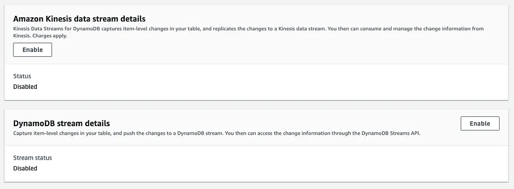
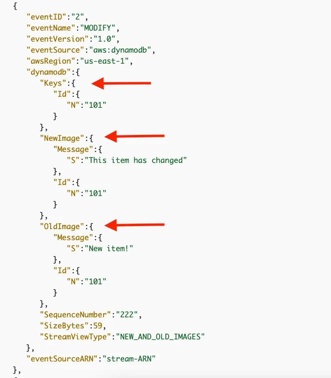

***Stream do AWS DynamoDB*** - Capture de dados de alterações para tabela do DynamoDB

Como habilitar o fluxo de mudança para uma tabela DynamoDB? Qual é a composição dos eventos de mudança? Como ler e processar um stream do DynamoDB ?

***Caso de uso***: Muitas das vezes criamos microserviços para realizar as operações no DynamoDB, com isso provisionamos uma infra, criada dentro de um cluster, temos CPU e memoria, e recursos de Scaling para se preocupar, dado que precisamos conhecer as tabelas e os campos que ali estão, também realizamos os parse de cada campo da tabela, criando entidade na arquitetura da aplicação, e usamos o SDK do serviço para se comunicar com o mesmo dentro da AWS, porque não utilizar o DynamoDB Stream para realizar tudo isso ?

O DynamoDB fornece duas abordagens de Change Data Capture (CDC) para capturar alterações de uma tabela. Aqui darei exemplos com os **Stream do DynamoDB** como um mecanismo confiável de CDC, como ele funciona e de que maneiras podemos consumir eventos de mudança dele.

#### O problema
Imagine que seu aplicativo inseri uma entrada (um objeto de usuário) em uma tabela DynamoDB. Um função Lambda está interessada em processar esse registro para enviar um e-mail de boas-vindas ao novo usuário.


Como você implementaria isso ?

Existem duas opções:

1. A primeira aplicação tem que fazer Dual Write. O que significa que ele deve grava no DynamoDB e também notificar o Lambda sobre isso. Talvez publicar um evento sobre um tópico do SNS?

2. O Lambda precisa pesquisar a tabela do DynamoDB periodicamente.

Ambas as abordagens são aparentemente complicadas ou ineficientes.

E se a tabela do DynamoDB transmitir as alterações feitas no nível do item?

Felizmente, o DynamoDB fornece um mecanismo Change Data Capture (CDC) para cada tabela.

Isso significa que se alguém criar uma nova entrada ou modificar um tem em uma tabela, o DynamoDB emitirá imediatamente um evento contendo as informações sobre a alteração. Você pode criar aplicativos que consumam esses eventos e executem ações com base no contéudo.


O DynamoDB monitora cada modificação nos itens de dados de uma tabela e os transmite como eventos em tempo real. Atualmente, existem dois modelos de streaming.

1. Os eventos de alteração são gravados em um **Kinesis Data Stream** de sua escolha.

2. Os eventos de mudança são gravados em um **Stream do DynamoDB** com um ARN exclusivo.

É posivel habilitar os dois modelos de streaming na mesma tabela do DynamoDB.


>Você pode ativar ambas as opções para uma tabela do DynamoDB

Em ambos os modelos, os eventos de mudança são gravados em fluxos de forma assíncrona, sem afetar o desempenho da tabela. Além disso, os eventos de ambos os fluxos são armazenados após a criptografia.

Embora dois modelos de streaming tenham algumas semelhanças, existem algumas diferenças em termos de tempo de retenção de eventos, opções de escala, ordem de eventos e preços. Você pode encontrar uma comparação detalhada entre os dois modelos de streaming em seu [artigo](https://medium.com/lumigo/the-best-reason-to-use-dynamodb-streams-is-6573fa2a511f)

Aqui iremos focar somente sobre como capturar alterações em um fluxo exclusivo do DynamoDB.

#### Alterar captura de dados para streams do DynamoDB
Essencialmente, um fluxo do DynamoDB é um fluxo de informações ordenado por tempo sobre modificações no nível do item em uma tabela do DynamoDB. Quando você habilita um stream em uma tabela, o DynamoDB registra cada modificação nos itens da tabela e os anexa a um log.

Cada tabela do DynamoDB habilitada para streaming recebe um arquivo de log dedicado que mantém as informações de alteração por até 24 horas. Os aplicativos podem acessar esse log e visualizar os itens de dados conforme eles apareciam antes e depois de serem modificados quase em tempo real.

Para cada fluxo de mudança proveniente de uma tabela, o DynamoDB garante o seguinte:

- Cada registro de stream aparece exatamente uma vez no stream.
- Para cada item modificado em uma tabela do DynamoDB, os registros de fluxo aparecem na mesma sequência das modificações reais no item.

#### Anatomia de um stream do DynamoDB
>Conteúdo de um registro de stream
Sempre que itens são criados, atualizados ou excluídos em uma tabela, o DynamoDB Streams grava um registro de stream com os atributos de chave primária dos itens modificados.

Um registro de fluxo contém informações sobre uma modificação de dados em um único item em uma tabela do DynamoDB. Além disso, cada registro possui um número de sequência, refletindo a ordem em que o registro foi publicado no stream.

Quando um registro de alteração é gravado no fluxo, é possível controlar quais informações o registro deve conter. Existem quatro opções para escolher:

- Somente chaves — Somente os atributos principais do item modificado.
- Nova imagem — O item inteiro, como aparece depois de modificado.
- Imagem antiga — O item inteiro, como aparecia antes de ser modificado.
- Imagens novas e antigas — As imagens novas e antigas do item.

Por exemplo, quando a opção **Imagens novas e antigas** é selecionada, uma atualização de linha em sua tabela de origem produzirá um evento MODIFY parecido com este:



#### Fragmentos

Os registros de fluxo são organizados em grupos ou fragmentos . Cada fragmento atua como um contêiner para vários registros de fluxo e contém informações necessárias para acessar e iterar por meio desses registros. **Os registros de fluxo em um fragmento são removidos automaticamente após 24 horas.**

Os fragmentos permitem que vários consumidores leiam registros de fluxo em paralelo para aumentar o rendimento do processamento. Os limites padrão permitem até 2 consumidores simultâneos por fragmento.

O diagrama a seguir mostra o relacionamento entre um fluxo, fragmentos no fluxo e registros de fluxo nos fragmentos.


>Cortesia da documentação do AWS DynamoDB

#### Habilitando/desabilitando um stream
Você pode ativar um fluxo em uma nova tabela, desativar um fluxo em uma tabela existente ou alterar as configurações de um fluxo usando uma das seguintes maneiras.

1. AWS Management Console — A abordagem mais direta.
2. AWS CLI — Para automação.
3. AWS SDK — Para controle programático.

A [documentação da AWS](https://docs.aws.amazon.com/amazondynamodb/latest/developerguide/Streams.html#Streams.Enabling) fornece mais informações sobre isso.

#### Cada stream recebe um ARN exclusivo
O DynamoDB cria um novo stream com um descritor de stream exclusivo quando um stream é habilitado em uma tabela. Se você desabilitar e reativar um fluxo na tabela, um novo fluxo será criado com um descritor de fluxo diferente.

Cada stream é identificado exclusivamente por um nome de recurso da Amazon (ARN). A seguir está um exemplo de ARN para um stream em uma tabela do DynamoDB chamada ```TestTable```.

```arn:aws:dynamodb:us-west-2:111122223333:table/TestTable/stream/2015–05–11T21:21:33.291```

#### Processando um stream do DynamoDB
Antes de processar um stream do DyanamoDB, o consumidor deve localizá-lo.

#### Localizando um stream do DynamoDB
A convenção de nomenclatura para um endpoint de stream do DynamoDB é streams.dynamodb.<region>.amazonaws.com. Se sua tabela do DynamoDB estiver localizada na us-west-2região, você deverá usar a mesma região para acessar seu stream do DynamoDB.

Isso resulta em streams.dynamodb.us-west-2.amazonaws.com.

Para acessar um stream e processar os registros do stream, você deve fazer o seguinte:

Descubra o ARN exclusivo do stream.
Determine quais fragmentos no stream contêm os registros de stream de seu interesse.
Acesse os fragmentos e recupere os registros de fluxo desejados.
Para isso, DyanamoDB oferece duas opções.

Usando o adaptador DynamoDB Streams Kinesis

A documentação do DynamoDB diz:

>Usar o Amazon Kinesis Adapter é a maneira recomendada de consumir streams do Amazon DynamoDB. A API DynamoDB Streams é intencionalmente semelhante à do Kinesis Data Streams, um serviço para processamento em tempo real de dados de streaming em grande escala. Em ambos os serviços, os fluxos de dados são compostos por fragmentos, que são contêineres para registros de fluxo. As APIs de ambos os serviços contêm operações ListStreams, DescribeStream, GetShards e GetShardIterator.

Como usuário do DynamoDB, você pode reutilizar a semântica dos streams de dados do Kinesis para processar um stream do DynamoDB.

O AWS SDK fornece uma API de baixo nível para acessar um fluxo de dados do Kinesis. Além disso, você pode usar a Kinesis Client Library (KCL) para desenvolver aplicativos de consumo. KCL é mais conveniente e oferece suporte a vários idiomas, incluindo Java , NodeJS , . NET , Python e Ruby .

Você pode escrever um consumidor do DynamoDB da mesma forma que acessa um stream do Kinesis. Para fazer isso, use o adaptador DynamoDB Streams Kinesis. O Kinesis Adapter implementa a interface do Kinesis Data Streams para que a KCL possa ser usada para consumir e processar registros do DynamoDB Streams.

O diagrama a seguir mostra como essas bibliotecas interagem entre si.


Como utilizar o DynamoDB Stream para construir uma solução com MSK Kafka, para um fluxo de Stream de Dados ?

>Farei uma poc, com as tecnologias sitadas no console da AWS, e irei documentar o procedimento por aqui.
