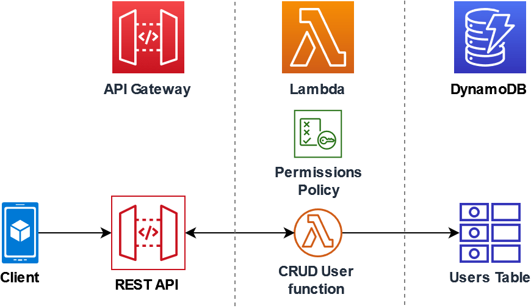

#### Uso do Lambda com API Gateway

>Estudo de caso em uma arquitetura serveless, apenas seguindo as boas praticas, sem ditar regras.

**API REST** que será usada para invocar uma função do Lambda usando uma solicitação **HTTP**. A função do **Lambda** executará operações de criação, leitura, atualização e exclusão **(CRUD)** em uma tabela do **DynamoDB**. Essa função será fornecida aqui para fins de demonstração, com essa configuração sera possivel uma **API REST** do **API Gateway** que pode invocar qualquer função do **Lambda**.

Por natureza a Lambda já nasce escalavel, o ***API Gateway*** suporta mil ***TPS*** e as ***Lambdas*** são invocadas por demanda. Tirando o ***Code Start***, que no caso de utilizar o Golang para codar a lambda, temos 1000 mil segundos para a inicialização, já a faixa de resposta sem serviços externos é em média 0,5 ms.

A ideia é ter o ***Gateway*** chamando as functions, uma rota por ***Lambda***. que por sua vez tem ***1M*** de chamadas gratuitas por mês.

>Para uma arquitetura orientada a eventos, vale um teste de performance, para validar o RPS e TPS suportados, isso se estivermos falando de outras integrações que precisam previamente serem realizadas antes do start da Lambda.



Codigo da solução:

```python
import boto3
import json

tableName = "lambda-apigateway"

dynamo = boto3.resource('dynamodb').Table(tableName)

print(f'Lambda iniciando para realizar as operações na tabela: {tableName}')

def lambda_handler(event, context):
    def ddb_create(x):
        dynamo.put_item(**x)

    def ddb_read(x):
        dynamo.get_item(**x)

    def ddb_update(x):
        dynamo.update_item(**x)

    def ddb_delete(x):
        dynamo.delete_item(**x)

    def echo(x):
        return x

    operation = event['operation']

    operations = {
        'create': ddb_create,
        'read': ddb_read,
        'update': ddb_update,
        'delete': ddb_delete,
        'echo': echo,
    }

    print(f'Operacao "{}", realizada com sucesso na tabela: {tableName}')

    if operation in operations:
        return operations[operation](event.get('payload'))
    else:
        raise ValueError('Operação não conhecida "{}", verifique o contrato da API e tente novamente.'.format(operation))
```

Montei uma demo mais estruturada, para a realização dessa integração, segue o [link](https://github.com/MateusMaceedo/APIGatewayAWSLambda) do github.

##### Referencias
- https://docs.aws.amazon.com/pt_br/lambda/latest/dg/services-apigateway-tutorial.html
