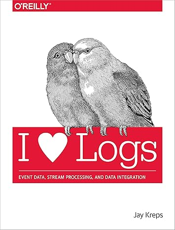
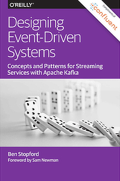
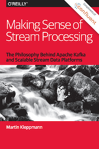
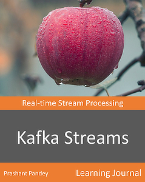

>Os livros que influenciam as melhores praticas abordando o Apache Kafka e/ou o assunto de streaming de eventos em geral.

#### 1. Kafka The Definite Guide

#### 2. I Heart Logs: Event Data, Stream Processing, and Data Integration (English Edition)

#### 3. Designing Data-Intensive Applications

#### 4. Designing Event-Driven Systems

#### 5. Making Sense of Stream Processing

#### 6. Kafka Streams in Action

#### 7. Kafka Streams: Real-time Stream Processing

#### 8. Event Streams in Action

#### Referências e artigos acadêmicos

- [KSQL: Streaming SQL Engine para Apache Kafka](https://openproceedings.org/2019/conf/edbt/EDBT19_paper_329.pdf) por Hojjat Jafarpour, Rohan Desai, Damian Guy; EDBT '19: Anais da 22ª Conferência Internacional sobre Extensão de Tecnologia de Banco de Dados, 2019.

- [Streams and Tables: Two Sides of the Same Coin](https://dl.acm.org/doi/10.1145/3242153.3242155) by Matthias J. Sax, Guozhang Wang, Matthias Weidlich, Johann-Christoph Freytag; BIRTE '18: Proceedings of the International Workshop on Real-Time Business Intelligence and Analytics, 2018.

- [Apache Kafka](https://link.springer.com/referenceworkentry/10.1007/978-3-319-63962-8_196-1) by Matthias J. Sax; Encyclopedia of Big Data Technologies, Springer, Cham, 2018.

- [Building a Replicated Logging System with Apache Kafka](https://dl.acm.org/doi/10.14778/2824032.2824063) by Guozhang Wang, Joel Koshy, Sriram Subramanian, Kartik Paramasivam, Mammad Zadeh, Neha Narkhede, Jun Rao, Jay Kreps, Joe Stein; VLDB Endowment '15: Proceedings of the VLDB Endowment,Vol. 8, No. 12, 2015.

- [Liquid: Unifying Nearline and Offline Big Data Integration](https://www.semanticscholar.org/paper/Liquid%3A-Unifying-Nearline-and-Offline-Big-Data-Fernandez-Pietzuch/e478f9eef5fe91b1fe422b9d7d41b27586749b38) by Raul Castro Fernandez, Peter R. Pietzuch, Jay Kreps, Neha Narkhede, Jun Rao, Joel Koshy, Dong Lin, Chris Riccomini, Guozhang Wang; CIDR '15: 7th Biennial Conference on Innovative Data Systems Research, 2015.

- [Kafka, Samza and the Unix Philosophy of Distributed Data](http://sites.computer.org/debull/A15dec/p4.pdf) by Martin Kleppmann, Jay Kreps, Bulletin of the IEEE Computer Society Technical Committee on Data Engineering, 2015.

- [The Log: What every software engineer should know about real-time data's unifying abstraction](https://engineering.linkedin.com/distributed-systems/log-what-every-software-engineer-should-know-about-real-time-datas-unifying) by Jay Kreps, 2013.

- [Building LinkedIn’s Real-time Activity Data Pipeline](http://sites.computer.org/debull/A12june/pipeline.pdf) by Ken Goodhope, Joel Koshy, Jay Kreps, Neha Narkhede, Richard Park, Jun Rao, Victor Yang Ye; Bulletin of the IEEE Computer Society Technical Committee on Data Engineering, 2012.

- [Data Infrastructure at LinkedIn](https://ieeexplore.ieee.org/document/6228206) by Aditya Auradkar et al.; IEEE 28th International Conference on Data Engineering, 2012.

- [Kafka: a Distributed Messaging System for Log Processing](https://www.microsoft.com/en-us/research/wp-content/uploads/2017/09/Kafka.pdf) by Jay Kreps, Neha Narkhede, Jun Rao; NetDB workshop '11, 2011.

- [Papers Complete](https://kafka.apache.org/books-and-papers)
