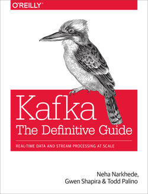

>Os livros que influenciam as melhores praticas abordando o Apache Kafka e/ou o assunto de streaming de eventos em geral.

#### 1. Kafka The Definite Guide

#### Referências e artigos acadêmicos

- [KSQL: Streaming SQL Engine para Apache Kafka](https://openproceedings.org/2019/conf/edbt/EDBT19_paper_329.pdf) por Hojjat Jafarpour, Rohan Desai, Damian Guy; EDBT '19: Anais da 22ª Conferência Internacional sobre Extensão de Tecnologia de Banco de Dados, 2019.
