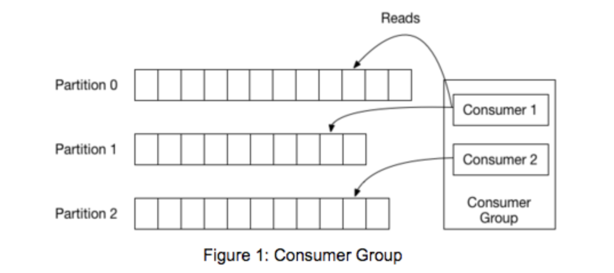
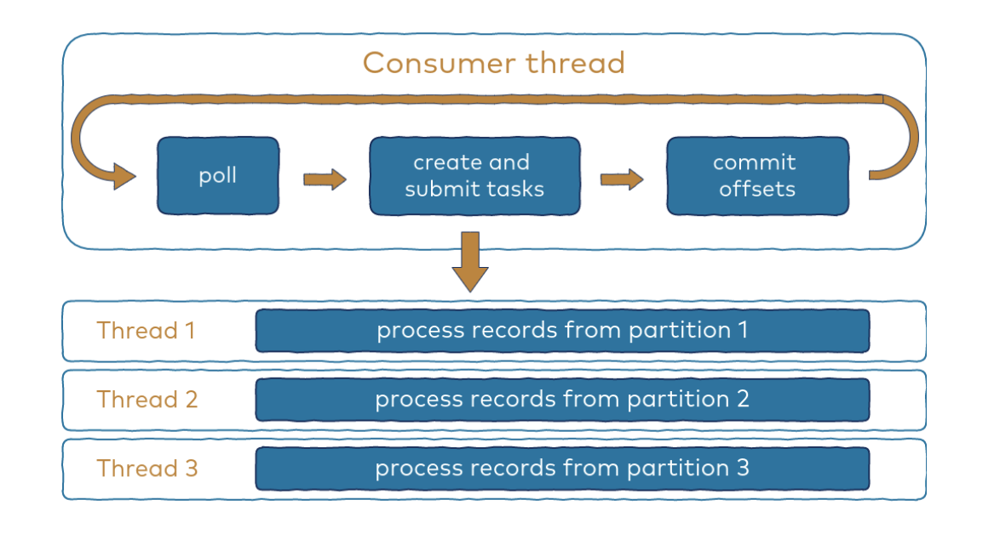
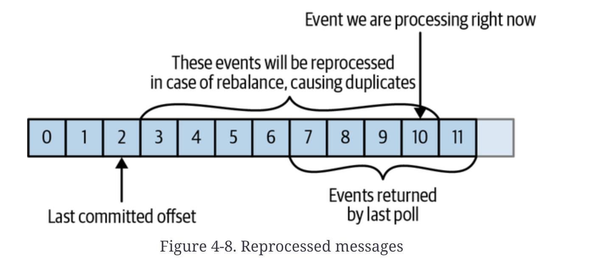
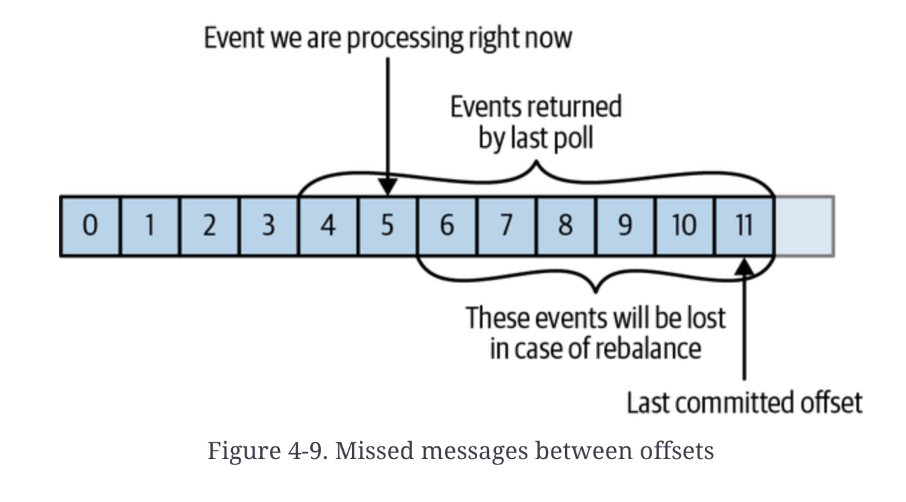

# Consumers

## Conceito

Cada tópico do Kafka é subdividido em partições. Os produtores escrevem na cauda das partições e os consumidores lêem a partir da cabeça. O Kafka escala o consumo de um tópico distribuindo as partições entre um _consumer group_, que é uma coleção de consumidores dividindo um único identificador de grupo.


No exemplo acima temos três partições no tópico e foram dividas entre dois consumidores em um único grupo, onde o consumidor 1 assumiu a partição 0 e 1 e o consumidor 2 ficou com a partição 2.

## Simples exemplo de consumidor

```java
Duration timeout = Duration.ofMillis(100);

while (true) {
    ConsumerRecords<String, String> records = consumer.poll(timeout);

    for (ConsumerRecord<String, String> record : records) {
        final var topic = record.topic();
        final var partition = record.partition();
        final var offset = record.offset();
        final var key = record.key();
        final var value = record.value();

        System.out.printf("topic = %s, partition = %d, offset =
            %d, customer = %s, country = %s\\n", topic, partition, offset, key, value);
    }

    try {
        consumer.commitSync();
    } catch (CommitFailedException e) {
        log.error("commit failed", e);
    }
}
```

## Escalando consumo em multi-threaded

Como mencionado anteriormente, os eventos são agrupados por partições que podem ser consumidas paralelamente sem prejudicar a ordem. Isso normalmente é feito configurando múltiplos consumidores para um _consumer group_, cada um processando uma ou mais partições de um tópico.

Para a maioria dos casos, ler e processar as mensagens em uma única thread é OK. Quando não envolve I/O é normalmente muito rápido. Quando necessitamos de escala no processamento, precisamos entender melhor sobre como o Kafka funciona, pois a implementação multi-threaded pode se tornar perigosa e complexa.

Nesse ambiente multi-threaded, o consumidor principal do Kafka delega o processamento dos eventos obtidos no `poll` para outras _threads_.



Para garantir ordem no processamento, é necessário pausar as partições através do `KafkaConsumer.pause` .

[Multi-Threaded Messaging with the Apache Kafka Consumer (confluent.io)](https://www.confluent.io/blog/kafka-consumer-multi-threaded-messaging/)

## **Mensagens duplicadas ou perda de mensagens**

É possível sim acontecer de seu consumer ler mensagens duplicadas por conta de _rebalance_ de _partitions._



Perda de mensagens



## Lidando com throttling de mensagens

Pensando em um cenário onde a arquitetura é baseada em uma aplicação fazendo pooling e enviando para outra aplicação processar de maneira non-blocking, ou seja, sem esperar o cliente processar, o alto consumo de mensagens pode ser um problema já que é uma ferramenta para alto throughput.

Exemplo: Uma aplicação em nodejs consumindo de uma partição do kafka e enviando via post sem await (fire and forget) para uma outra aplicação.

### Lado do Kafka

Os brokers do Kafka possuem a habilidade de limitar o rate a qual as mensagens são produzidas ou consumidas, que é feito via mecanismo de Quota. Existem três tipos de Quotas: produce, consume e request.

Do lado do kafka é possível utilizar dos parametros para suavizar o consumo. Todavia, pode ser complexo chegar na configuração correta.

-   **fetch.min.bytes**: Especifica o tamanho mínimo das mensagens que o consumidor deseja receber. Enquanto não atingir, o broker vai continuar bufferizando.
-   **[fetch.max.wait.ms](http://fetch.max.wait.ms)**: Especifica o máximo de tempo que um consumidor pode ficar sem receber mensagem. É bastante utilizado com a propriedade anterior, já que limita o mínimo de bytes. Exemplo: Se o min de bytes é 5mb e o max wait ms é 1 segundo, a cada 1 segundo haverá consumo das mensagens independente se atingiu os 5mb ou não.
-   **max.partition.fetch.bytes**: Especifica o tamanho máximo de bytes que serão retornados por partição.
-   **[session.timeout.ms](http://session.timeout.ms)**: Especifica o tempo que um consumidor pode ficar sem se comunicar com o broker enquanto ainda se considera vivo.
-   **max.poll.records**: Controla o máximo de eventos que serão consumidos ao chamar `poll` .

### Lado do consumidor

-   **Rate limiter**: A
-   **Pause & resume**: Esses métodos são úteis para pausar o consumo de determinadas partições sem precisar fazer a thread dormir.

> Kafka supports dynamic controlling of consumption flows by using pause(Collection) and resume(Collection) to pause the consumption on the specified assigned partitions and resume the consumption on the specified paused partitions respectively in the future poll(long) calls.
