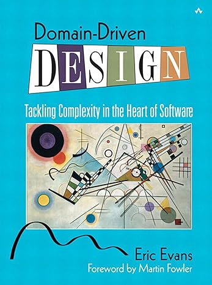

Aqui estão os livros que me influenciaram e influencia até os dias de hoje, para construção de software, seguindo boas praticas, tendo como principio ter os meus conhecimentos atuais mais fixados, eu costumo ler bastante sobre uma determinada tecnologia e elencar em projetos reais, para colocar em pratica aquilo que estudo. Para não cair na rotina, leio diariamente varios assuntos ligados a tecnologia, tomada de decisão e até organização de projetos, firmando os conhecimento de:

- **Distributed Systems**
- **Fault-Tolerant Systems**
- **Scalability**
- **Reliability Engineering**
- **System Design**
- **Clean Architecture**
- **Functional Programming**
- **Vavr**
- **Arrow Kt**
- **Kotlin**
- **Java**
- **Golang**
- **Clojure**
- **Reactive Stack**
- **SOLID**
- **Spring Boot**
- **Spring Cloud**
- **Python**

>Ser sênior é medido por duas coisas, sua **experiência** e suas **habilidades tecnicas**.

#### Minha Biblioteca Virtual - (Se trata de uma lista incremental, ao longo do anos acrescento mais livros de acordo com o que estou trabalhando)

#### 1. The staff engineers path

##### Descrisão do livro
O caminho do engenheiro de equipe (edição em inglês)

Durante anos, as empresas recompensaram seus engenheiros mais eficazes com cargos de gestão. Mas tratar a gestão como o caminho padrão para um engenheiro com capacidade de liderança não serve bem à indústria – ou ao engenheiro. O caminho do engenheiro de equipe permite que os engenheiros contribuam em alto nível como modelos, conduzindo grandes projetos, determinando estratégias técnicas e aumentando as habilidades de todos.

Este livro detalhado mostra como compreender sua função, administrar seu tempo, dominar o pensamento estratégico e definir o padrão para o trabalho técnico. Você lerá sobre como ser um líder sem autoridade direta, como planejar com antecedência para tomar as decisões técnicas corretas e como tornar todos ao seu redor melhores, ao mesmo tempo em que cresce como especialista em seu domínio.

Ao explorar os três pilares do trabalho de um engenheiro de equipe, Tanya Reilly, uma veterana na área de engenharia de equipe, mostra como:

- Tenha uma visão ampla e estratégica ao pensar no seu trabalho
- Mergulhe em táticas práticas para tornar os projetos bem-sucedidos
- Determine o que significa “boa engenharia” em sua organização

##### Sobre o Autor
Tanya Reilly tem mais de vinte anos de experiência em engenharia de software, trabalhando mais recentemente em arquitetura e estratégia técnica como engenheira principal sênior no Squarespace. Anteriormente, ela foi engenheira do Google, responsável por alguns dos maiores sistemas distribuídos do planeta. Tanya escreve sobre liderança técnica e confiabilidade de software em noidea.dog. Ela é organizadora e anfitriã da conferência LeadDev StaffPlus e palestrante frequente e palestrante principal. Originária da Irlanda, ela agora mora no Brooklyn com o marido, o filho e a máquina de café expresso.

Wendy Tremont King, uma atriz com formação clássica e marionetista talentosa, começou na narração de audiolivros como voluntária em O Farol para Cegos e narrou mais de 100 audiolivros em uma variedade de gêneros. Ela se apresentou em produções de teatro de áudio multicast ao vivo e gravadas com Pocket Universe, The One Act Players, Misfits Audio e Shoestring Radio. Sua voz ressonante, inteligência e senso de humor generoso são descritos como tendo uma qualidade emocional autêntica. Wendy mora em Buffalo, Nova York, e pode ser encontrada jogando pedras no Buffalo Curling Club.

#### 2. Team topologies

#### 3. The software engineers guide book

#### 4. Staff Engineer: leadership beyound the management track

#### 5. Fundamentals of Software Architecture

#### 6. Patterns Of Enterprise Application Architecture

##### Descrisão do livro

A prática do desenvolvimento de aplicações empresariais beneficiou-se do surgimento de muitas novas tecnologias facilitadoras. Plataformas orientadas a objetos multicamadas, como Java e .NET, tornaram-se comuns. Estas novas ferramentas e tecnologias são capazes de construir aplicações poderosas, mas não são facilmente implementadas. Falhas comuns em aplicativos corporativos geralmente ocorrem porque seus desenvolvedores não entendem as lições de arquitetura que os desenvolvedores de objetos experientes aprenderam.

***Padrões de arquitetura de aplicativos corporativos*** foi escrito em resposta direta aos duros desafios enfrentados pelos desenvolvedores de aplicativos corporativos. O autor, o notável designer orientado a objetos Martin Fowler, percebeu que apesar das mudanças na tecnologia – de Smalltalk a CORBA, de Java a .NET – as mesmas ideias básicas de design podem ser adaptadas e aplicadas para resolver problemas comuns. Com a ajuda de um grupo de colaboradores especializados, Martin destila mais de quarenta soluções recorrentes em padrões. O resultado é um manual indispensável de soluções aplicáveis ​​a qualquer plataforma de aplicativos empresariais.

Este livro é na verdade dois livros em um. A primeira seção é um breve tutorial sobre desenvolvimento de aplicativos corporativos, que você pode ler do início ao fim para entender o escopo das lições do livro. A próxima seção, a maior parte do livro, é uma referência detalhada aos próprios padrões. Cada padrão fornece informações de uso e implementação, bem como exemplos de código detalhados em Java ou C#. O livro inteiro também é ricamente ilustrado com diagramas UML para explicar melhor os conceitos.

Armado com este livro, você terá o conhecimento necessário para tomar decisões arquiteturais importantes sobre a construção de um aplicativo corporativo e os padrões comprovados para uso ao construí-los.

Os tópicos abordados incluem:

- Dividindo um aplicativo corporativo em camadas
- As principais abordagens para organizar a lógica de negócios
- Um tratamento aprofundado do mapeamento entre objetos e bancos de dados relacionais
- Usando Model-View-Controller para organizar uma apresentação na Web
- Tratamento da simultaneidade para dados que abrangem diversas transações
- Projetando interfaces de objetos distribuídos

##### Sobre o Autor

**Martin Fowler** é um consultor independente que aplica objetos a problemas empresariais prementes há mais de uma década. Ele prestou consultoria sobre sistemas em áreas como saúde, negociação financeira e finanças corporativas. Seus clientes incluem Chrysler, Citibank, Serviço Nacional de Saúde do Reino Unido, Andersen Consulting e Netscape Communications. Além disso, Fowler é palestrante regular sobre objetos, Linguagem de Modelagem Unificada e padrões.

#### 7. Padrões de Projetos

##### Descrisão do livro

##### Sobre o Autor

#### 8. Ultra Aprendizagem

#### 9. Programador Pragmatico

#### 10. Entendo Algoritmos

#### 11. Estrutura de dados com algoritmos com JavaScript °2 Edição

#### 12. Optimization by GRASP: Greedy Randomized Adaptive Search Procedures

#### 13. Deep Learning for Coders with fastai & PyTorch: AI Applications Without a PhD

#### 14. Hands-on Convolutional Neural Networks with TensorFlow: Solve computer vision problems with modeling in TensorFlow and Python

#### 15. Learning Domain-Driven Design (English Edition)

#### 16. Código limpo: habilidades práticas do Agile Software

#### 17. Programming Kotlin: Familiarize yourself with all of kotlin's features with this in-depth guide (Em Inglês)

#### 18. Programação Shell Linux - 8 Ed.

#### 19. Fundamentals of Software Architecture: An Engineering Approach (English Edition)

#### 20. System Design Interview – An insider's guide (English Edition)

#### 21. System Design Interview – An Insider's Guide: Volume 2 (English Edition)

#### 22. Domain-Driven Design: Tackling Complexity in the Heart of Software (English Edition)

#### 23. Refactoring: Improving the Design of Existing Code (Addison-Wesley Signature Series (Fowler)) (English Edition)

#### 24. Clean Architecture: A Craftsman's Guide to Software Structure and Design (Robert C. Martin Series) (English Edition)

#### 25. Agile Principles, Patterns, and Practices in C# (Robert C. Martin Series) (English Edition)

