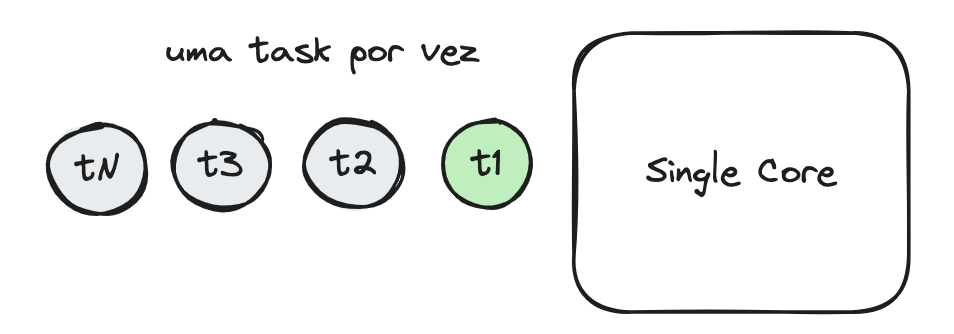
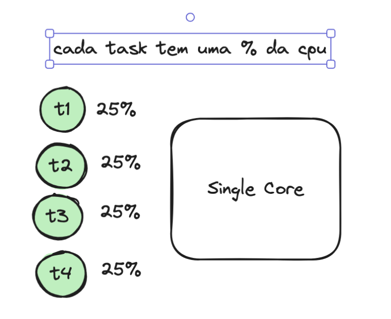

---

### Não configure Resource CPU Limit no Kubernetes

>Contexto em como a alocação de CPU funciona no Kernel do Linux.

>Vamos olhar para o core/núcleo de um processador, ele é capaz de processar uma única operação por vez, não tem mágica, você manda a operação ele processa e retorna. Se você tem dois cores, então… adivinha só ? duas operações por vez. Pera ai, mas e para processadores com Hyper Threading ? Não se engane, o core/núcleo do processador continua processando task a task, uma por vez, a tecnologia Hyper Threading (presente em processadores intel) mantém o core mais tempo processando do que ocioso, ou seja, usa melhor o tempo, mas nada mudou no núcleo, continuamos não podendo paralelizar as tarefas.

Falamos um pouco da camada de hardware, agora vamos para a camada de software. Para simplificar, vamos imaginar um processador com apenas 1 core **(um Intel 4004, talvez ? :D)**. Se você simplificar as coisas e pensar que 1 core pode processar 1 task por vez, e você tiver uma task que vai levar 10min 😩 para terminar, significa que seu processador vai ficar processando apenas esta task por 10min, o que obviamente travaria todo seu Sistema Operacional. Imagina, enquanto você está baixando um arquivo você não iria conseguir mexer o mouse, digitar no teclado, ou escutar uma música 😡.

É para isso que existem o que chamamos de CPU Schedulers. São programas que rodam no S.O que fazem o gerenciamento das tasks que irão rodar no core do processador, e obviamente eles não vão permitir que sua task de 10min cause um starvation nos outros processos. E como isso funciona ? Bom, existem diversos tipos de Schedulers, dependendo do seu S.O, vamos focar aqui no **Linux**. A partir da versão 2.6.23 do **Kernel** do **Linux** é utilizado um Scheduler chamado Completely Fair Scheduler **(a.k.a CFS)**.

O **CFS**, como o nome já diz, tenta garantir a distribuição justa (fair) da **CPU** entre os processos do **S.O**. Em termos simples, isso significa que se você tem 1 core e 2 processos **(P1 e P2)**, P1 vai usar 50% da **CPU** e **P2** vai usar 50% da **CPU**, em termos simples ok ? É bem mais complexo que isso, envolve prioridade e agrupamento de processos, mas em termos gerais o **CFS** tenta distribuir igualmente.

Ok, agora que você entende como as tasks são distribuídas no núcleo do processador, vamos falar de **Kubernetes**. Mas primeiro, tenha em mente uma importante lição tirada da explicação acima, se você ainda não notou é claro, o ideal é que o processador fique ocupado 100% do tempo, usando 100% do seu núcleo para processar o máximo de tarefas, sem ociosidade.

Para o **Kubernetes** existem 2 tipos de recursos: compressible resources e not compressible resources. É isso mesmo, traduzindo para o Português, recursos compreensíveis e não compreensíveis. A memória, por exemplo, é um recurso não compreensível porque ao atingir o máximo permitido o K8s vai enviar um sinal de **SIGKILL** para o seu **POD**, por outro lado a **CPU** é um recurso compreensível, ou seja, mesmo que você esteja com 100% de uso, o K8s não vai mandar um **SIGKILL**. Porque isso ? A memória tem um tamanho finito, e quando você a enche não tem mais para onde ir, o que fazer ? Matar qualquer processo que tente usar mais memória do que o disponível. Já a **CPU** (agora que você é um expert em Linux **CFS** 😅), tenta alocar todos os processos, porque ela trabalha com tempo, e o tempo é infinito **(Aristóteles)**, filosófico não ? 🥸. É óbvio se você tiver milhares de processos e apenas 1 core, cada processo vai usar 0,001% da cpu, deixando o seu S.O muito lento, devido a grande quantidade de troca entre os processos no núcleo do processador.

Acho que agora posso responder porque não usar Limit **CPU** no **K8s**. Quando você configura um limite de CPU, vamos supor 200m (200 millicores), você está dizendo para o **K8s**: “não deixe meu processo usar mais de 200 milissegundos da CPU a cada ciclo de 1 segundo“. Então vamos supor que por alguns instantes a **CPU** esteja livre de outros processos, você poderia estar usando 100% dela, mas estará limitado a 20% (200m), com 80% da cpu ociosa, é igual ter um carro de **500cv** para fazer um percurso de 1km todo dia. Agora imagina que você tire esse limite, o **Linux CFS** vai tentar distribuir igualmente a carga da **CPU** entre seus **PODs**, e cá entre nós, provavelmente ele fará um trabalho melhor que eu e você tentando configurar um limite de **CPU** 🤨.

Agora um aviso muito ***!!IMPORTANTE!!***, eu não estou dizendo que você deve sair tirando o limit CPU de todos os seus projetos. Se você tem PODs que não precisam de alto throughput , você deve sim limitar o uso de **CPU**, para que não haja uma concorrência pelo uso da **CPU** com outros **PODs** que realmente precisam de alto throughput. Lembra que o **Linux CFS** vai tentar distribuir igualmente o uso da **CPU**, e **PODs** que precisam de alta vazão podem ser impactados por aqueles que não precisam, simplesmente porque o **CFS** vai tentar ser fair , lembra ?

#### Scale Up/Down/In/Out

