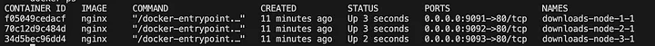

O que são os profiles ? Vou explicar com o método ELI5. Imagine que você tem um YAML super complexo, que provisiona vários servidores Nginx, um em cada porta. Mas agora você quer testar um ou dois servidores apenas, em vez de subir todos, o que pode demorar muito tempo. Para isso, você pode assinar tags (a.k.a profiles) aos seus serviços, então no nosso exemplo vamos dividir assim:

Profile shard-a (poderia ser qualquer nome no local do shard-a), vai conter o node-1 e node-2.
Profile shard-b, vai conter o node-3.
Esses nodes criei apenas para facilitar a explicação, mas eles são imagens nginx, nas portas 9091, 9092 e 9093 respectivamente. Olha só como ficou meu YAML:

```yaml
version: '3'

services:
  node-1:
    image: nginx
    ports:
      - 9091:80
    profiles:
      - all
      - shard-a
  node-2:
    image: nginx
    ports:
      - 9092:80
    profiles:
      - all
      - shard-a
  node-3:
    image: nginx
    ports:
      - 9093:80
    profiles:
      - all
      - shard-b
```

Notou a seção profiles ? Temos 3 tags: all, shard-a e shard-b. Lembra que falei que profile são como tags, então já que o all está presente em todos os serviços, quando eu executar o comando docker para subir meus containers com a tag all, todos os serviços serão iniciados. Vejamos o que acontece quando eu executo o comando up de acordo com os profiles:

Subindo todos os serviços, usando o profile all:

```bash
docker-compose --profile all up
```

Resultado:



Subindo todos os serviços, usando o profile shard-b:

```bash
docker-compose --profile shard-b up
```

Resultado:


apenas o node-3 está online.

O exemplo acima foi feito com um YAML muito simples, mais isso ajuda muito, quando temos um YML com varios recursos.
